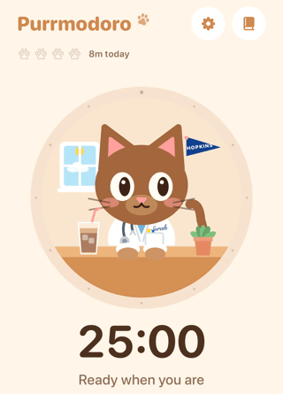
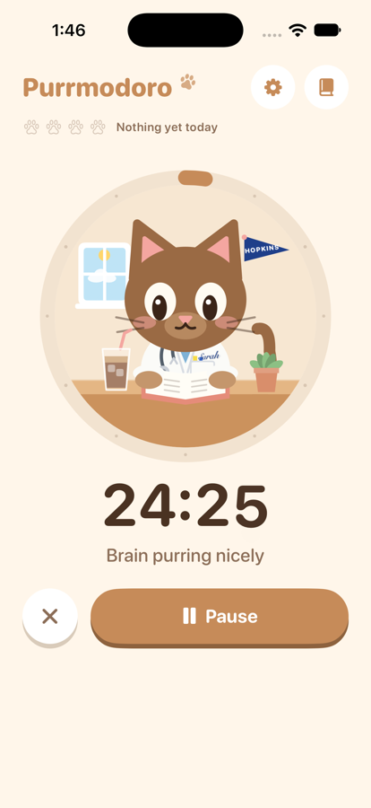
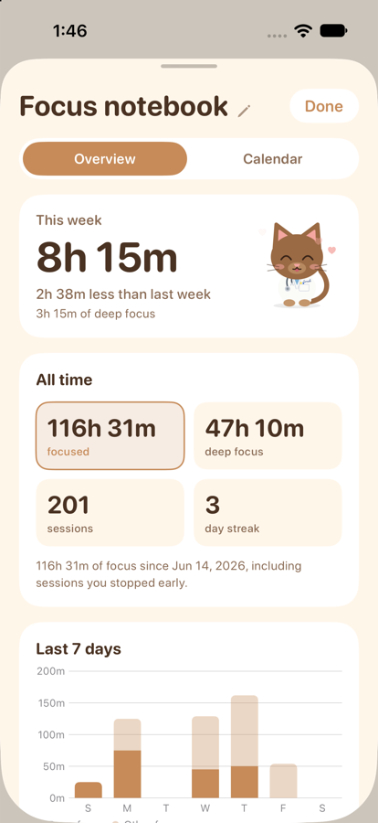
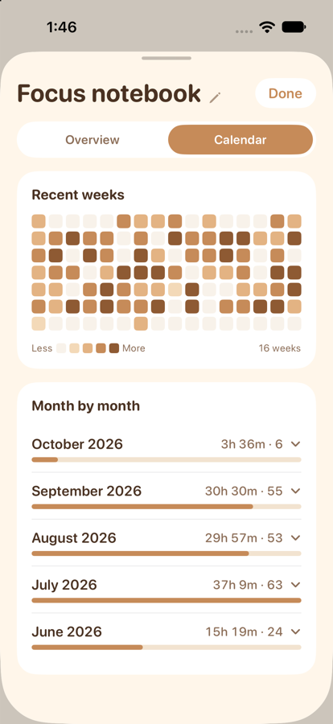
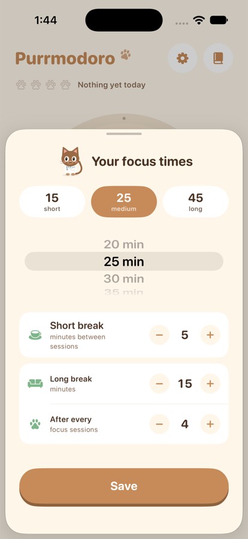
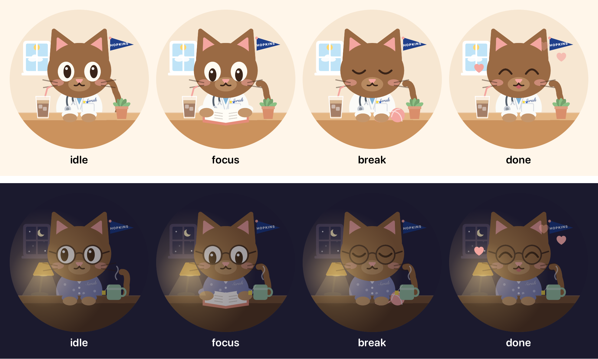

# Purrmodoro 🐾

A cozy little focus timer for iPhone, starring a brown kitty who studies with you. Made by C for S.

  
  
  
  

Screenshots use sample data.

## What it does

- **Pomodoro timer:** three presets (short, medium, long) plus "wind the clock": drag around the ring to set any time up to 60 minutes. The kitty's eyes follow your finger.
- **Focus and breaks:** short breaks between sessions, a long break after every few. Nothing starts without a tap.
- **The kitty's room:** she sits at her desk inside the timer ring. In the day she wears a white coat (with "Sarah" stitched on) and has iced coffee. At night it's pajamas, glasses, a warm lamp, and tea. The window follows the real time of day.
- **Pet the kitty:** tap her ears, head, nose, belly, tail, or paws for different reactions (and a rare purr).
- **Lock screen and Dynamic Island:** a live countdown with pause, resume, and end buttons.
- **Home screen widget:** the kitty, the timer, and today's focus.
- **Focus notebook:** this week, all-time stats, the last 7 days, when you focus best, a calendar heatmap, each day's sessions, and notes.
- **Gentle sounds:** synthesized marimba, music box, and singing bowl alarms, plus little pops and purrs. Adjustable volume.
- **Day and night:** the whole app goes dark and cozy after sunset.

## Built with

- SwiftUI, SwiftData, WidgetKit, ActivityKit, and App Intents. No third-party libraries.
- The kitty, her room, and the app icon are drawn in code (`Shared/KittyView.swift`).
- Sounds are synthesized by `Tools/make_sounds.py`.
- Everything stays on the phone. No accounts, no servers, no tracking.

## Project layout

| Folder | What's inside |
|---|---|
| `App/` | The app: screens, timer engine, notebook, settings, sounds |
| `Widgets/` | Home screen widget and the lock screen / Dynamic Island countdown |
| `Shared/` | Code both use: the kitty drawing, timer model, colors, time-of-day sky |
| `Tools/` | Sound generator |
| `docs/` | The product spec, plans, and screenshots |
| `project.yml` | The Xcode project definition (XcodeGen) |

## Building it

1. Install Xcode and [XcodeGen](https://github.com/yonaskolb/XcodeGen) (`brew install xcodegen`).
2. Run `xcodegen generate` in this folder, then open `Purrmodoro.xcodeproj`.
3. Pick an iPhone (iOS 18+) and press Run. On a free Apple account, installs last 7 days.

Debug-only launch options for testing: `-fastTimer` (a minute lasts a second), `-seedDemo` (sample history), `-forceDay` (daytime look at any hour).

## Ideas for later

- **Make it yours:** right now the kitty's coat says "Sarah" and the pennant says "HOPKINS" because this started as a gift. If it's ever shared, a "Make it yours" section in Settings would let anyone set the name on the coat and pajamas, their school or team on the pennant, and maybe the kitty's name and fur color.
- **Ring even on silent** with AlarmKit (see the plan below).
- **Collectibles:** treats, outfits, room decor, and rare kitties earned through focus time.
- **Real weather** in the window.

## Docs

- [Product spec](docs/spec.md): what the app does and why.
- [AlarmKit plan](docs/alarmkit-plan.md): a planned "ring even on silent" option.
